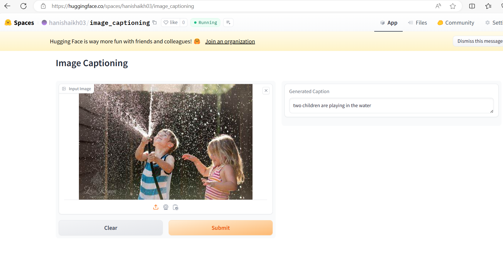

# Image Captioning

## What is Image Captioning?

Image Captioning is the process of generating textual description of an image. It uses both Natural Language Processing and Computer Vision to generate the captions. This task lies at the intersection of computer vision and natural language processing. Most image captioning systems use an encoder-decoder framework, where an input image is encoded into an intermediate representation of the information in the image, and then decoded into a descriptive text sequence.

## CNNs + RNNs (LSTMs)

To perform Image Captioning, we will require two deep learning models combined into one for the training purpose:

- **CNNs**: CNNs extract the features from the image of some vector size, also known as the vector embeddings. The size of these embeddings depends on the type of pretrained network being used for the feature extraction.

- **LSTMs**: LSTMs are used for the text generation process. The image embeddings are concatenated with the word embeddings and passed to the LSTM to generate the next word. For a more illustrative explanation of this architecture, check the Modelling section for a picture representation.

## Image Feature Extraction

- DenseNet 201 Architecture is used to extract the features from the images.
- Since the Global Average Pooling layer is selected as the final layer of the DenseNet201 model for our feature extraction, our image embeddings will be a vector of size 1920.

## Model Details

The deep learning model used in this app is a DenseNet201 architecture pretrained on the ImageNet dataset. It is then fine-tuned on a dataset of images with corresponding captions. The model uses an attention mechanism and an LSTM network to generate captions based on the features extracted from the image.

## Deployment

This is a simple app for generating captions for images using a deep learning model. We deployed a Gradio app into Huggingface spaces​.
Link: https://huggingface.co/spaces/hanishaikh03/image_captioning

## Usage

1. Upload an image.
2. Click the "Submit" button.
3. Wait for the caption to be generated.
4. The generated caption will be displayed next to the image in the 'Output' tab.

## Result

## Acknowledgments

- Flickr8K Dataset
- 

